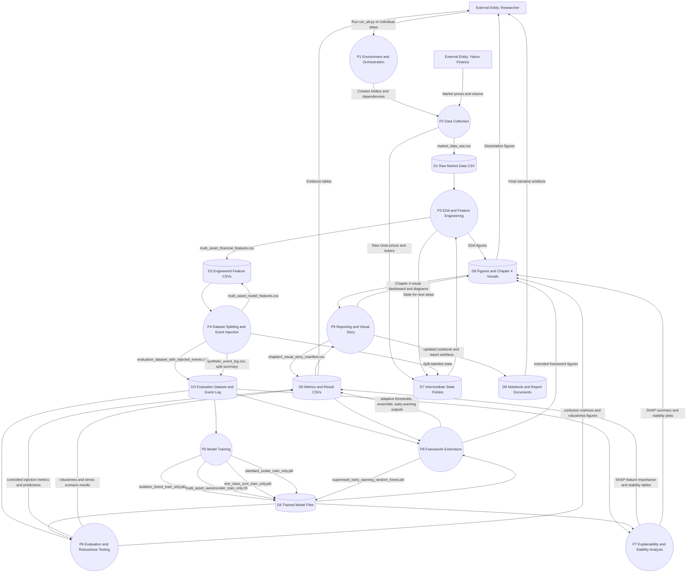

# Financial AI Robustness Evaluation: DFD and Documentation

Generated from the current workspace in `C:\Code` on 2026-04-17.

## Supervised Conversion Update

The active runnable pipeline has now been converted from unsupervised anomaly
detection to supervised drawdown-risk prediction. `run_all.py` keeps Steps 1-6
for setup, imports, Yahoo Finance data, EDA, feature engineering, and
`feature_cols`, then runs the new supervised scripts:

| Step | Active script | Purpose |
|---|---|---|
| 7 | `scripts/supervised_step_07_target_split.py` | Add `Future_Return_5D` and `Target`; create chronological splits |
| 8 | `scripts/supervised_step_08_logistic.py` | Train Logistic Regression |
| 9 | `scripts/supervised_step_09_random_forest.py` | Train Random Forest |
| 10 | `scripts/supervised_step_10_xgboost.py` | Train XGBoost when installed, otherwise Gradient Boosting fallback |
| 11 | `scripts/supervised_step_11_evaluation.py` | Calculate Accuracy, Precision, Recall, F1, ROC-AUC, and confusion counts |
| 12 | `scripts/supervised_step_12_robustness.py` | Measure prediction flips, F1 drop, and AUC drop under Gaussian noise |
| 13 | `scripts/supervised_step_13_stress.py` | Compare baseline F1 with stressed F1 under financial scenarios |
| 14 | `scripts/supervised_step_14_shap.py` | Generate SHAP explanations for the strongest tree classifier |
| 15 | `scripts/supervised_step_15_shap_stability.py` | Measure SHAP stability under perturbation |
| 16-20 | `scripts/supervised_step_16_...py` to `scripts/supervised_step_20_...py` | Produce summary, narrative, validation, visuals, and Chapter 4 story |

The supervised target is:

```python
df["Future_Return_5D"] = df.groupby("Ticker")["Close"].shift(-5) / df["Close"] - 1
df["Target"] = (df["Future_Return_5D"] <= -0.03).astype(int)
```

Meaning:

- `0` = normal / no major near-term drawdown.
- `1` = drawdown-risk event.

The old unsupervised scripts are still present for history, but `run_all.py`
now follows the supervised route.

This document explains the complete project workflow that has been built in this workspace: the financial data pipeline, model training, robustness testing, explainability analysis, framework extensions, and dissertation-ready outputs.

## 1. Project Overview

The project is a reproducible dissertation pipeline for evaluating the robustness and explainability of financial anomaly detection models. It uses multi-asset market data, engineers financial and technical indicators, injects controlled stress events, trains several anomaly detection models, evaluates them on chronological train/validation/test splits, and produces tables and figures for Chapter 4 reporting.

The main implementation is split into 20 Python scripts in `scripts/`, orchestrated by `run_all.py`. Outputs are stored under `dissertation_outputs/`.

Primary artefacts:

| Area | Location | Purpose |
|---|---|---|
| Source scripts | `scripts/step_01_...py` to `scripts/step_20_...py` | Reproducible step-by-step pipeline |
| Raw and processed data | `dissertation_outputs/data/` | Market data, engineered features, event labels |
| Trained models | `dissertation_outputs/models/` | Isolation Forest, Autoencoder, One-Class SVM, Random Forest early-warning model |
| Result tables | `dissertation_outputs/results/` | Metrics, robustness results, SHAP summaries, manifests |
| Figures | `dissertation_outputs/figures/` | EDA plots, model plots, robustness plots, SHAP plots |
| Chapter 4 visuals | `dissertation_outputs/figures/chapter4_visuals/` | Export-ready dissertation visual story |
| Notebook/document outputs | `Updated_Financial_AI_Robustness_Evaluation.ipynb`, `Financial_AI_Robustness_Results.doc` | Updated notebook and written report artefacts |

## 2. DFD Context Diagram


## 3. Level 0 DFD



## 4. Level 1 DFD: Pipeline Steps

```mermaid
flowchart TB
    Start([Start: run_all.py])

    S01[Step 01: Environment setup]
    S02[Step 02: Install/import libraries]
    S03[Step 03: Download market data]
    S04[Step 04: Exploratory data analysis]
    S05[Step 05: Feature engineering]
    S06[Step 06: Prepare model features]
    S07[Step 07: Chronological split and injected event labels]
    S08[Step 08: Train Isolation Forest]
    S09[Step 09: Train Autoencoder]
    S10[Step 10: Train One-Class SVM]
    S11[Step 11: Supervised evaluation of detectors]
    S12[Step 12: Gaussian perturbation robustness testing]
    S13[Step 13: Financial stress scenario testing]
    S14[Step 14: SHAP explainability for primary model]
    S15[Step 15: Explanation stability testing]
    S16[Step 16: Final model summary and failure analysis]
    S17[Step 17: Dissertation narrative mapping]
    S18[Step 18: Validation checks and research alignment]
    S19[Step 19: Framework extensions]
    S20[Step 20: Chapter 4 visual story]
    End([End: dissertation-ready outputs])

    Start --> S01 --> S02 --> S03 --> S04 --> S05 --> S06 --> S07
    S07 --> S08 --> S09 --> S10 --> S11 --> S12 --> S13 --> S14 --> S15 --> S16 --> S17 --> S18 --> S19 --> S20 --> End
```



## 5. What Has Been Done

### 5.1 Workspace Restructuring

The original notebook workflow has been split into separate, runnable scripts under `scripts/`. The `scripts/README.md` explains how to run the scripts one-by-one or through the `run_all.py` orchestrator.

The pipeline uses intermediate state files in `dissertation_outputs/state/` so later scripts can load previous step outputs without rerunning the whole notebook.

### 5.2 Data Collection

The project downloads historical market data using `yfinance` for ten assets:

`AAPL`, `MSFT`, `NVDA`, `AMZN`, `JPM`, `GS`, `KO`, `XOM`, `SPY`, and `QQQ`.

The configured date range is:

| Field | Value |
|---|---|
| Start date | 2010-01-01 |
| End date | 2024-01-01 |
| Raw output | `dissertation_outputs/data/market_data_raw.csv` |

### 5.3 Exploratory Data Analysis

EDA figures were generated to show market trends, return distributions, and relationships across assets.

Examples:

| Figure | Purpose |
|---|---|
| `stock_price_trends_multi_asset.png` | Compare asset price movement over time |
| `aapl_returns_distribution.png` | Inspect return distribution for AAPL |
| `asset_correlation_heatmap.png` | Show correlations across assets |
| `daily_returns_boxplot_by_asset.png` | Compare return distributions across all assets |
| `rolling_volatility_aapl_covid_highlight.png` | Highlight volatility during the COVID-19 market shock |

### 5.4 Feature Engineering

The pipeline creates financial and technical features used by the anomaly models:

| Feature group | Examples |
|---|---|
| Returns | `Return`, `Return_Zscore_20` |
| Volatility | `Volatility_10`, `Volatility_20` |
| Momentum and trend | `Momentum_10`, `MA_Ratio_10`, `MA_Ratio_20` |
| Volume | `Volume_Change` |
| Distribution shape | `Rolling_Skew_20`, `Rolling_Kurt_20` |
| Risk and drawdown | `Drawdown` |
| Technical indicators | `RSI_14`, `MACD`, `MACD_Signal`, `BB_Width` |

Feature outputs:

| Output | Description |
|---|---|
| `multi_asset_financial_features.csv` | Full financial feature dataset |
| `multi_asset_model_features.csv` | Model-ready feature subset |
| `feature_correlation_heatmap_multi_asset.png` | Feature correlation visualization |
| `rolling_volatility_plot_aapl.png` | Rolling volatility visualization |

### 5.5 Evaluation Dataset and Time Split

The data is split chronologically to avoid training on future information.

| Split | Rows | Assets | Start Date | End Date |
|---|---:|---:|---|---|
| Train | 24510 | 10 | 2010-02-02 | 2019-10-25 |
| Validation | 5250 | 10 | 2019-10-28 | 2021-11-24 |
| Test | 5260 | 10 | 2021-11-26 | 2023-12-29 |

Controlled events are injected and logged so the models can be evaluated against known anomaly labels.

Important files:

| File | Description |
|---|---|
| `evaluation_dataset_with_injected_events.csv` | Main labelled evaluation dataset |
| `synthetic_event_log.csv` | Event definitions and injected-event records |
| `time_series_split_summary.csv` | Chronological split summary |

### 5.6 Baseline Model Training

Three unsupervised anomaly detectors were trained using train-only data:

| Model | Saved file | Purpose |
|---|---|---|
| Isolation Forest | `isolation_forest_train_only.pkl` | Tree-based anomaly detector |
| Autoencoder | `multi_asset_autoencoder_train_only.h5` | Reconstruction-error anomaly detector |
| One-Class SVM | `one_class_svm_train_only.pkl` | Boundary-based anomaly detector |
| StandardScaler | `standard_scaler_train_only.pkl` | Scaling support for Autoencoder and One-Class SVM |

Training only on the chronological training split is important because it avoids data leakage.

### 5.7 Controlled Injection Evaluation

The baseline detectors were evaluated against the injected event labels. Current test-set results in `chapter4_model_performance_with_ensemble.csv` are:

| Model | Precision | Recall | F1 Score | TP | FP | FN | TN |
|---|---:|---:|---:|---:|---:|---:|---:|
| Isolation Forest | 0.189 | 0.389 | 0.255 | 35 | 150 | 55 | 5020 |
| Autoencoder | 0.089 | 0.867 | 0.161 | 78 | 801 | 12 | 4369 |
| One-Class SVM | 0.063 | 0.989 | 0.118 | 89 | 1328 | 1 | 3842 |
| Ensemble Majority Vote | 0.207 | 0.844 | 0.332 | 76 | 292 | 14 | 4878 |

Interpretation:

- Isolation Forest is more conservative and produces fewer false positives than Autoencoder and One-Class SVM.
- Autoencoder and One-Class SVM achieve high recall but at the cost of many false positives.
- The majority-vote ensemble improves the F1 score relative to the individual baseline models while keeping high recall.

### 5.8 Robustness Testing

The pipeline tests prediction stability under Gaussian perturbation noise.

Main outputs:

| File | Description |
|---|---|
| `perturbation_robustness_results_standardized.csv` | Baseline robustness under perturbation |
| `ensemble_gaussian_robustness_results.csv` | Ensemble robustness under perturbation |
| `jaccard_vs_noise_with_ensemble.csv` | Jaccard similarity by noise level and model |
| `robustness_degradation_curve.csv` | Label-flip degradation curve data |
| `label_flips_vs_gaussian_perturbation_standardized.png` | Label-flip visualization |
| `jaccard_vs_noise_with_ensemble.png` | Robustness comparison including ensemble |
| `robustness_degradation_curve.png` | Degradation curve figure |

### 5.9 Stress Scenario Testing

Financial stress scenarios are used to test model behavior under market-like shocks rather than random noise alone.

Main outputs:

| File | Description |
|---|---|
| `financial_stress_scenarios_results_standardized.csv` | Baseline stress scenario results |
| `ensemble_stress_scenarios_results.csv` | Ensemble stress scenario results |
| `stress_scenarios_results_with_ensemble.csv` | Combined stress results |
| `stress_scenario_robustness_with_ensemble.png` | Stress robustness comparison |
| `stress_scenario_detection_timeline_aapl.png` | AAPL detection timeline |

### 5.10 Explainability and SHAP Stability

SHAP explainability was added for the anomaly detection models. The original analysis scoped SHAP to Isolation Forest, then Step 19 extended SHAP outputs to Autoencoder and One-Class SVM.

Main outputs:

| File | Description |
|---|---|
| `shap_feature_importance_test_sample.csv` | Isolation Forest SHAP feature importance |
| `shap_feature_importance_autoencoder.csv` | Autoencoder SHAP feature importance |
| `shap_feature_importance_oneclass_svm.csv` | One-Class SVM SHAP feature importance |
| `shap_feature_importance_autoencoder_ocsvm.csv` | Combined Autoencoder and One-Class SVM SHAP table |
| `shap_stability_all_levels_standardized.csv` | Isolation Forest SHAP stability |
| `shap_stability_autoencoder_ocsvm.csv` | Autoencoder and One-Class SVM SHAP stability |
| `shap_stability_multi_asset.csv` | Multi-asset SHAP stability |
| `shap_rank_shift_heatmap_data.csv` | SHAP rank-shift data |

SHAP figures:

| Figure | Description |
|---|---|
| `shap_summary_plot_test_sample.png` | Isolation Forest SHAP summary |
| `shap_summary_autoencoder.png` | Autoencoder SHAP summary |
| `shap_summary_oneclass_svm.png` | One-Class SVM SHAP summary |
| `shap_stability_vs_perturbation_standardized.png` | Explanation stability under perturbation |
| `shap_rank_shift_heatmap.png` | Feature-rank movement under perturbation |
| `shap_stability_multi_asset.png` | SHAP stability across selected assets |

### 5.11 Framework Extensions

Step 19 adds dissertation-strength evidence beyond the original baseline pipeline:

| Extension | Output |
|---|---|
| Validation-tuned adaptive thresholds | `adaptive_thresholds_validation_tuned.csv` |
| Adaptive predictions | `adaptive_ensemble_predictions.csv` |
| Majority-vote ensemble | `adaptive_ensemble_metrics.csv` |
| Supervised early-warning classifier | `supervised_early_warning_random_forest.pkl` |
| Early-warning metrics and predictions | `supervised_early_warning_metrics.csv`, `supervised_early_warning_predictions.csv` |
| Feature importance for early warning | `supervised_early_warning_feature_importance.csv` |
| ROC curves | `roc_curves_framework_models.png` |
| Confusion matrices | `confusion_matrices_framework_models.png` |
| Runtime benchmark | `runtime_benchmark_prediction.csv` |
| McNemar pairwise model comparison | `mcnemar_pairwise_model_comparison.csv` |
| Artifact manifest | `framework_extension_artifact_manifest.csv` |

Validation-tuned thresholds:

| Model | Threshold | Validation Precision | Validation Recall | Validation F1 |
|---|---:|---:|---:|---:|
| Isolation Forest | -0.0561 | 0.085 | 0.689 | 0.152 |
| Autoencoder | 0.6950 | 0.137 | 0.478 | 0.213 |
| One-Class SVM | 1.0413 | 0.176 | 0.867 | 0.293 |

Extended test results:

| Model | Precision | Recall | F1 Score | ROC AUC |
|---|---:|---:|---:|---:|
| Isolation Forest Adaptive | 0.091 | 0.744 | 0.163 | 0.909 |
| Autoencoder Adaptive | 0.117 | 0.689 | 0.200 | 0.911 |
| One-Class SVM Adaptive | 0.207 | 0.833 | 0.332 | 0.968 |
| Ensemble Majority Vote | 0.207 | 0.844 | 0.332 | 0.963 |
| Supervised Early Warning | 0.717 | 0.211 | 0.326 | 0.774 |

The supervised early-warning model uses a 3-day warning horizon and is trained from the validation split.

### 5.12 Chapter 4 Visual Story

Step 20 creates export-ready figures for the dissertation results chapter.

Generated Chapter 4 visuals include:

| Figure | Purpose |
|---|---|
| `01_framework_pipeline_diagram.png` | High-level method diagram |
| `02_model_performance_metric_heatmap.png` | Precision/recall/F1 heatmap |
| `03_precision_recall_tradeoff_bubble.png` | Precision-recall trade-off |
| `04_ensemble_lift_vs_isolation_forest.png` | Ensemble improvement over baseline |
| `05_detection_outcome_breakdown.png` | TP/FP/FN comparison |
| `06_runtime_vs_f1_tradeoff.png` | Runtime and quality trade-off |
| `07_gaussian_robustness_jaccard_heatmap.png` | Robustness under Gaussian perturbation |
| `08_stress_scenario_robustness_heatmap.png` | Stress scenario robustness |
| `09_cross_model_shap_feature_heatmap.png` | Cross-model SHAP comparison |
| `10_shap_stability_spearman_heatmap.png` | Explanation stability heatmap |
| `11_supervised_early_warning_summary_panel.png` | Early-warning model summary |
| `12_chapter4_evidence_dashboard.png` | Combined headline evidence dashboard |

## 6. Main Data Stores

| Store | Path | Contains |
|---|---|---|
| D1 Raw data | `dissertation_outputs/data/market_data_raw.csv` | Historical market OHLCV data |
| D2 Features | `multi_asset_financial_features.csv`, `multi_asset_model_features.csv` | Engineered model features |
| D3 Labels and splits | `evaluation_dataset_with_injected_events.csv`, `synthetic_event_log.csv` | Chronological split labels and injected events |
| D4 Models | `dissertation_outputs/models/` | Saved ML models and scaler |
| D5 Results | `dissertation_outputs/results/` | CSV metrics, robustness outputs, SHAP outputs |
| D6 Figures | `dissertation_outputs/figures/` | PNG visual evidence |
| D7 State | `dissertation_outputs/state/` | Pickled intermediate data for step chaining |
| D8 Documents | root `.ipynb`, `.doc`, and this `.md` | Notebook/report documentation |

## 7. How to Run the Work

Run the whole project from `C:\Code`:

```powershell
python run_all.py
```

Run a single step:

```powershell
python scripts\step_08_isolation_forest.py
```

Important dependency rule:

- Steps 1 to 7 should be run at least once before later model and evaluation steps.
- Later steps depend on saved state files and generated CSV/model artefacts.
- Step 19 expects the baseline data and models from Steps 1 to 18.
- Step 20 expects the Step 19 framework-extension outputs.

## 8. Dissertation Interpretation

The completed work supports a dissertation argument around robust and explainable financial anomaly detection:

1. A reproducible chronological pipeline was built to avoid future data leakage.
2. Controlled event injection created a measurable benchmark for anomaly detection.
3. Multiple detector types were compared: tree-based, neural reconstruction-based, and boundary-based.
4. Gaussian perturbation and stress scenarios tested whether predictions remain stable under noisy or stressed conditions.
5. SHAP feature attribution connected predictions back to financial indicators.
6. Explanation stability analysis tested whether model reasoning changes under perturbation.
7. Adaptive thresholds and a majority-vote ensemble improved the practical detection framework.
8. A supervised early-warning layer explored whether the framework can anticipate near-future stress events.
9. Export-ready figures and tables were generated for dissertation Chapter 4.

## 9. Current Headline Findings

Based on the current saved outputs:

- The majority-vote ensemble has the strongest overall test F1 score among the main detector comparison, at about 0.332.
- One-Class SVM and Autoencoder detect many injected anomalies but create more false positives.
- Isolation Forest is more conservative, with fewer false positives but lower recall.
- The adaptive ensemble balances recall and precision better than individual high-recall models.
- The supervised early-warning model has much higher precision but lower recall, meaning it is selective when issuing warnings.
- SHAP and SHAP stability outputs now exist for the baseline model and extended models, giving dissertation evidence for explainability and robustness of explanations.

## 10. Recommended Use in the Dissertation

Use this project structure in the dissertation as follows:

| Dissertation section | Recommended evidence |
|---|---|
| Methodology | DFDs, chronological split table, feature list, model descriptions |
| Implementation | `scripts/` pipeline, `run_all.py`, reproducible output folders |
| Results | `chapter4_model_performance_with_ensemble.csv`, performance heatmaps, confusion matrices |
| Robustness | Gaussian perturbation tables, stress scenario figures, degradation curves |
| Explainability | SHAP summary plots, feature importance tables, SHAP stability heatmaps |
| Discussion | Trade-off between recall, precision, false positives, robustness, and runtime |
| Appendix | Full result CSV manifests and Chapter 4 visual manifest |

## 11. Summary

The workspace now contains a full end-to-end financial AI robustness evaluation system. It collects multi-asset market data, engineers financial features, creates controlled anomaly labels, trains and evaluates multiple anomaly detectors, tests robustness, explains model behavior with SHAP, extends the framework with adaptive thresholds and ensemble voting, and produces dissertation-ready evidence in CSV and PNG form.

This document provides the DFD and explanation needed to describe how data moves through the system and how each processing stage contributes to the final dissertation outputs.
